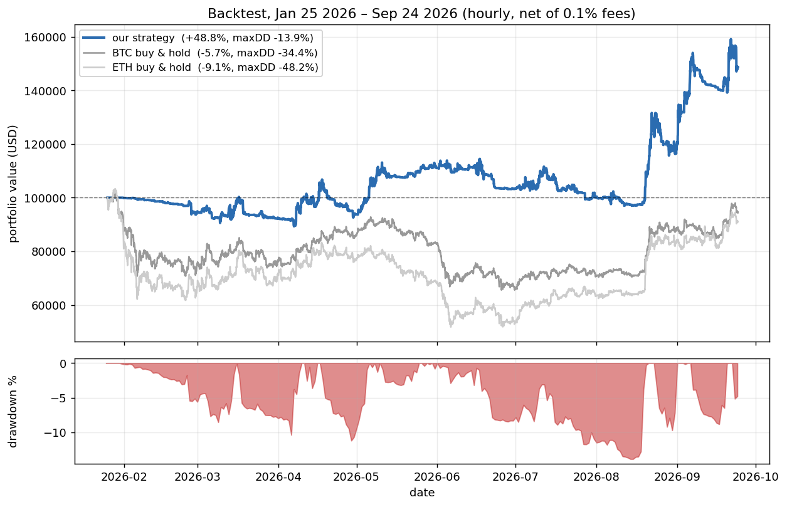

# Roostoo Hackathon Trading Bot

Our bot for the HK vs AU vs IN Quant Trading Hackathon (Roostoo mock exchange).
None of us had built a trading bot before, so we kept the design simple and
wrote lots of comments — partly for the judges, mostly for ourselves.

## What the strategy actually does

It's a momentum strategy. The short version: coins that have been going up
tend to keep going up for a while, so we hold the strongest ones — but only
when the overall market looks healthy.

Concretely, every hour the bot:

1. **Checks the market regime.** If BTC is below its 2-week moving average,
   we don't hold anything. Crypto is one market — when BTC bleeds, altcoin
   "momentum" is mostly fake-outs. In our rolling 14-day backtests this one
   rule took the median bear-market drawdown from -6% to basically zero.
2. **Scores each coin by momentum.** A blend of the last 24h and last 7d
   returns, across 22 liquid pairs.
3. **Applies a trend filter.** A coin only counts if it's above its own
   moving average.
4. **Sizes positions by 1/volatility.** Choppy coins get less money. This
   keeps the equity curve smooth, which is what Sharpe/Calmar reward.
5. **Caps everything.** Max 8 positions, max 20% in one coin, always keep
   ~5% cash for fees.

Things we deliberately don't do: high-frequency stuff, market making,
arbitrage (all banned anyway), and shorting — we backtested a long/short
version and it didn't help, it just doubled the fees. We also only enter or
resize positions once a day (exits are checked hourly), because at a 0.1%
taker fee, trading too often quietly eats you alive.

## Backtest results

Honest numbers, hourly data, 0.1% fee on every trade, Jan–Sep 2026:

| | Return | Sharpe | Sortino | Calmar | Max drawdown |
|---|---|---|---|---|---|
| Our strategy | +41.2% | 1.59 | 1.59 | 4.52 | -15.1% |
| BTC buy & hold | -11.9% | -0.15 | -0.16 | -0.44 | -38.4% |



To be clear about what this strategy is: it does well when the market trends
and mostly sits in cash when it doesn't. If Oct 4–17 turns out to be two
weeks of choppy sideways pain, we'll probably end up near 0% while pure-hold
bots lose money. We think that's the right trade when 70% of the composite
score (Sortino + Calmar) punishes downside — and the rolling-window tests
(`eval_windows.py`) back that up across 46 different 14-day slices.

## Files

```
bot.py              the live bot — this is the only thing that places trades
roostoo_client.py   API wrapper, logs every request to logs/api_log.csv
strategy.py         the signal logic (same functions the backtest uses)
risk.py             turns target weights into orders the exchange accepts
backtest.py         offline backtest with the judges' metrics
eval_windows.py     rolling 14-day evaluation — our main research tool
data_fetch.py       downloads historical hourly prices (Binance/Yahoo/CoinGecko)
seed_history.py     downloads ~2 weeks of prices before launch (see below)
plot_backtest.py    draws the equity curve above
deploy/             one-command EC2 setup + systemd service
CHECKLIST.md        our runbook for the whole competition
```

## Running the backtest

```bash
pip install -r requirements.txt
python backtest.py          # prints the metrics, saves the equity curve
python eval_windows.py      # rolling 14-day slices (~8 min, worth it)
```

## Running live

One thing that almost caught us out: the strategy needs about a week of
hourly price history before it can compute anything, but Roostoo has no
candle endpoint — the bot builds its own history by polling once an hour.
If you just start the bot on day 1, it sits in cash for a week. So:

```bash
cp .env.example .env        # add your keys
python seed_history.py 14   # download 2 weeks of history FIRST
python bot.py               # now it can trade from the first hour
```

On the AWS box we run `deploy/setup_ec2.sh`, which does all of the above and
installs a systemd service so the bot restarts itself if it crashes.

There's also a dry-run mode that paper-trades against live Roostoo prices
without needing keys — handy for rehearsing:

```bash
DRY_RUN=1 python3 -c "import bot; bot.run_once(full_rebalance=True)"
```

(wallet state is in `data/paper_state.json`, delete it to reset to $100k)

## Using it after the competition (Futu)

The broker code is a separate module from the strategy, so we wrote a second
client (`futu_client.py`) that talks to Futu's OpenAPI — same function
signatures as `roostoo_client.py`, nothing else changes. To run the bot
through a Futu paper account:

```bash
pip install "futu-api>=10.5.6508"   # needs OpenD running locally too
# in .env: BROKER_CLIENT=futu_client and FUTU_TRD_ENV=SIMULATE
python seed_history.py 14
python bot.py
```

Written against the API docs, not yet battle-tested — SIMULATE mode first.
One thing we learned while researching this: retail brokers charge around a
1% spread on crypto, which is 10x what this strategy assumes in fees. If we
ever run it for real money it would be through a proper exchange API
(ccxt), not a stock broker.

## Compliance stuff

- All trades come from `bot.py`. Nobody touches the API by hand during the
  competition.
- Every API request (success or failure) is logged in `logs/api_log.csv`,
  every order in `logs/trades.csv`.
- We commit changes to git as we make them — the history shows how the
  strategy evolved, including the ideas we tested and rejected.

## If you're judging this and want to ask us about

Why momentum works in crypto, why the regime switch matters more than any
other single rule, why we chose daily entries over hourly (fees), how the
rolling-window evaluation works and why we trust it more than a single
backtest, and the parameter sweep we ran to check we hadn't overfit (the
neighbours of our chosen parameters all perform within noise of each other,
which is what you want to see).
